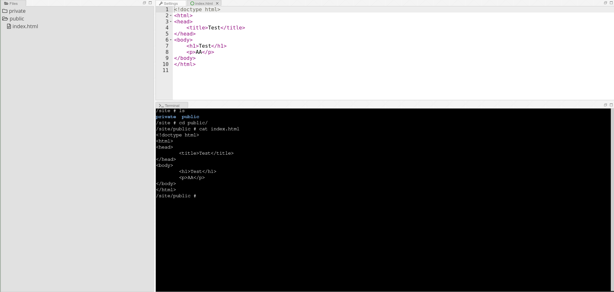
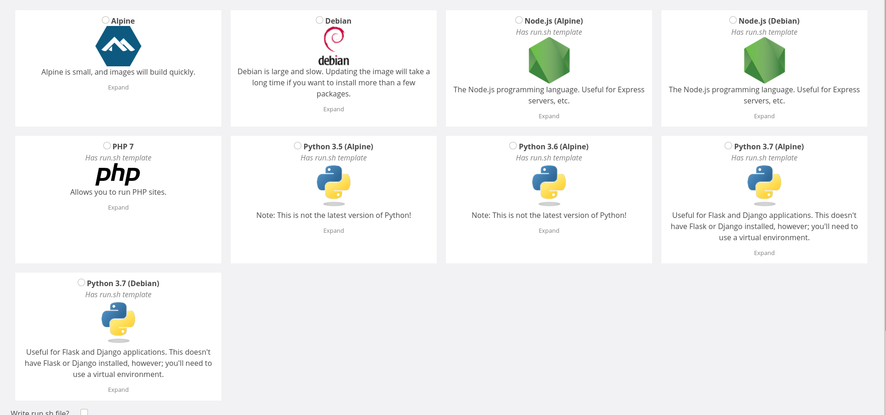

# Director 4.0: Scaling Website Management for the Masses

 

## Overview
Director 4.0 is a website management and hosting platform (based on the [former Director platform](https://github.com/tjcsl/director)) that is designed to scale. It replaces the former Director platform which has problems with performance, scalability, and ease of use.

It is composed of three primary components:
* `orchestrator`: The code that orchestrates the Docker containers
* `manager`: The public-facing Django web application that provides an easy-to-use interface for managing websites.
* `router`: The code that runs on the balancers and handles a lot of the frontend for custom domains.

## Architecture
A full description of the project's architecture can be found in [docs/ARCHITECTURE.md](docs/ARCHITECTURE.md).

## Requirements

### Software Requirements
* [Docker Engine](https://docs.docker.com/engine/): Used by the orchestrator to host sites that require dynamic generation
* [Python 3.6+](https://www.python.org/): Used by all components
* [RabbitMQ](https://www.rabbitmq.com/): Used by the manager to broker messages for long-running tasks
* [Celery](http://www.celeryproject.org/): Used by the manager to manage long-running tasks
* [Redis](https://redis.io/): Used by Django Channels on the manager as a channel layer
* [PostgreSQL](https://www.postgresql.org/): Used by the manager as the relational database
* [Nginx](https://nginx.org/): Used by the manager, orchestrator, and router as a reverse proxy, a load balancer, and for serving static files

Each of the three components has specific Python dependencies described in each `Pipfile`.

## Hardware/Resource Requirements

We recommend that you have a server for each component to replicate an actual production environment.

The resources (storage, memory, CPU, and network) required to run Director 4.0 depend on the number of sites being run, user load, request count, and other factors.

## Setup

We use Vagrant for providing a partial replica of a production environment. See [docs/SETUP.md](docs/SETUP.md) for details.

## Screenshots

## Licensing
This code is released under the MIT License as described in [LICENSE](LICENSE).

## Acknowledgments
The authors of Director 4.0 would like to acknowledge the [contributors](https://github.com/tjcsl/director/graphs/contributors) to the [TJHSST Director](https://github.com/tjcsl/director) application for providing inspiration for this project.

The authors of Director 4.0 would also like to acknowledge the support of the TJHSST Computer Systems Lab, especially research advisor Dr. Patrick White for his guidance and mentoring.

## Authors
- [@theo-o](https://github.com/theo-o)
- [@anonymoose2](https://github.com/anonymoose2)
